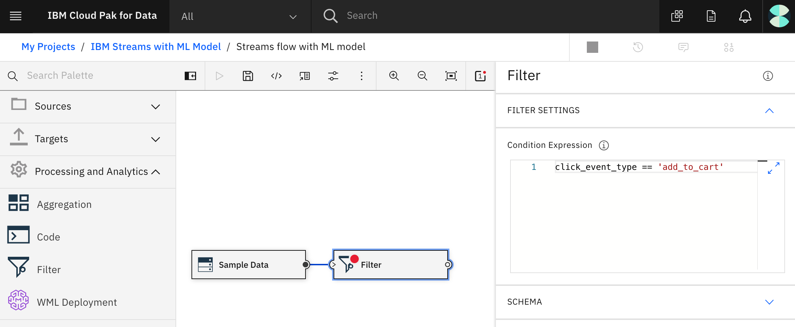

# Score streaming data with a machine learning model

In this code pattern, we will be streaming online shopping data and using the data to track the products that each customer has added to their cart. We will build a k-means clustering model with scikit-learn to group customers according to the contents of their shopping carts. The cluster assignment can be used to predict additional products to recommend.

Our application will be built using IBM Streams on IBM Cloud Pak for Data. IBM Streams provides a built-in IDE, called **Streams flows**, that allows developers to visually create their streaming application. The Cloud Pak for Data platform provides additional support, such as integration with multiple data sources, built-in analytics, Jupyter notebooks, and machine learning.

To build and deploy our machine learning model, we will use a Jupyter notebook in Watson Studio and a Watson Machine Learning instance. In our examples, both are running on IBM Cloud Pak for Data.

## Flow


1. User builds and deploys a machine learning model
1. User creates and runs an IBM Streams application
1. The Streams Flow UI shows streaming, filtering, and scoring in action

## Prerequisites

* IBM Cloud Pak for Data with Watson Studio, Watson Machine Learning, IBM Streams and Streams Flows.

## Steps

1. [Verify access to your IBM Streams instance on Cloud Pak for Data](#1-Verify-access-to-your-IBM-Streams-instance-on-Cloud-Pak-for-Data)
1. [Create a new project in Cloud Pak for Data](#2-create-a-new-project-in-cloud-pak-for-data)
1. [Build and store a model](#3-build-and-store-a-model)
1. [Associate the deployment space with the project](#4-Associate-the-deployment-space-with-the-project)
1. [Deploy the model](#5-Deploy-the-model)
1. [Create and run a Streams Flow application](#6-create-and-run-a-streams-flow-application)

### 1. Verify access to your IBM Streams instance on Cloud Pak for Data

Once you login to your `Cloud Pak for Data` instance, ensure that your administrator has provisioned an instance of `IBM Streams`, and has given your user access to the instance.

To see the available services, click on the `Services` icon. Search for `Streams`. You should see an `Enabled` indicator for `Streams`. `Watson Studio` and `Watson Machine Learning` also need to be enabled to build and deploy the model.


To see your provisioned instances, click on the (`☰`) menu icon in the top left corner of your screen and click `My Instances`.


### 2. Create a new project in Cloud Pak for Data

Click on the (`☰`) menu icon in the top left corner of your screen and click `Projects`.

Click on `New project +`. Then select `Create an empty project` and enter a unique name for your project. Click on `Create` to complete your project creation.


### 3. Build and store a model

We will build a model using a Jupyter notebook and scikit-learn. We're using a k-means classifier to group customers based on the contents of their shopping carts. Once we have built and stored the model, it will be available for deployment so that it can be used in our streaming application.

#### Import the notebook into your project

From the project `Assets` tab, click `Add to project +` on the top right and choose the `Notebook` asset type.


Fill in the following information:

* Select the `From URL` tab.
* Enter a `Name` for the notebook and optionally a description.
* For `Select runtime` select the `Default Python 3.6` option.
* Under `Notebook URL` provide the following url:
  ```url
  https://raw.githubusercontent.com/IBM/ibm-streams-with-ml-model/master/notebooks/shopping_cart_kmeans_cluster_model.ipynb
  ```
* Click the `Create notebook` button.


#### Edit the notebook

When you import the notebook you will be put in edit mode. Before running the notebook, you need to configure one thing:

* Edit the `WML Credentials` cell to set the `url` to the URL you use to access Cloud Pak for Data.


#### Run the notebook

Select `Cell > Run All` to run the notebook. If you prefer, you can use the `Run` button to run the cells one at a time. The notebook contains additional details about what it is doing. Here we are focusing on using IBM Streams with the resulting ML Model so we'll continue on once the notebook has completed.

### 4. Associate the deployment space with the project

The notebook created a deployment space named `ibm_streams_with_ml_model_deployment_space` and stored the model there.

* Inside your new project, select the `Settings` tab and click on `Associate a deployment space +`.


* Use `Existing` tab
* Select the `ibm_streams_with_ml_model_deployment_space` which was just created
* Click `Associate`

### 5. Deploy the model

* In your project, click on the newly associated deployment space named `ibm_streams_with_ml_model_deployment_space`.
* Select the `Assets` tab and click on the model named `Shopping Cart Cluster Model`.
* Click on the `Create deployment` button.
* Select `Online`, provide a deployment name, and click `Create`.

### 6. Create and run a Streams Flow application

Using the Streams Flows editor, we will create a streaming application with the following operators:

* A `Source` operator that generates sample clickstream data
* A `Filter` operator that keeps only the "add to cart" events
* A `Code` operator where we use Python code to arrange the shopping cart items into an input array for scoring
* A `WML Deployment` operator to assign the customer to a cluster
* A `Debug` operator to demonstrate the results

From the project panel, click the `Add to project +` button. Choose the `Streams flow` tile from the list of options.


Provide a unique name for the flow, and select the create `Manually` option. Then click `Create` to create the flow.


Once created, it will be displayed in the `Streams flow` editor.


On the left are the operators that can be drag-and-dropped onto the editor canvas. The operators are divided into types. For the purpose of this code pattern, we will use `Sources`, `Targets`, `Processing and Analytics`, and `WML Deployments`.

In the main icon bar at the top, you will see the options to `run` and `save` the flow.

#### Add sample clickstream data as data source

* From the `Sources` list, select and drag the `Sample Data` operator onto the canvas.


> NOTE: As you've probably already noticed, red error indicators tell you when required settings are missing. For example, some settings are required. You will also see that some operators require a source and/or target connection. When an operator has a red spot on it, you can hover over it to see what the errors are.

Click on the canvas object to see its associated properties. From the list of available data types in the `Topic` drop-down list, select `Clickstream`.


#### Add a Filter operator

From the `Processing and Analytics` list, select and drag the `Filter` operator onto the canvas.

* To connect the operators, click on the right-hand circle icon located in the source operator, and drap your mouse to the filter operator. This should result in a line connecting the two operators.

* Click on the Filter operator to see its associated properties. Set the `Condition Expression` to `click_event_type == 'add_to_cart'`. This will reduce the data stream to only the add_to_cart events.



#### Add a Code operator

* From the `Processing and Analytics` list, select and drag the `Code` operator onto the canvas
* Connect the `Filter` operator's target to this `Code` operator's source (using drag-and-drop like we did earlier)
* Click on the `Code` operator to see its associated properties. Depending on your version, you might see one or both of the following options:
  * If you have a `Coding Language` pulldown, select a `Python 3.x` version.
  * If you have a `Code Style` pulldown, select `Function`.
* In the `Code` property, paste in the following code:

  ```python
  # Preinstalled Python packages can be viewed from the Settings pane.
  # In the Settings pane you can also install additional Python packages.

  import sys
  import logging

  # Use this logger for tracing or debugging your code:
  logger = logging.getLogger(__name__)
  # Example:
  #     logger.info('Got to step 2...')

  # init() function will be called once on flow initialization
  # @state a Python dictionary object for keeping state. The state object is passed to the process function
  def init(state):
      # do something once on flow initialization and save in the state object
      state['keep_columns'] = ['Baby Food','Diapers','Formula','Lotion','Baby wash','Wipes','Fresh Fruits','Fresh Vegetables','Beer','Wine','Club Soda','Sports Drink','Chips','Popcorn','Oatmeal','Medicines','Canned Foods','Cigarettes','Cheese','Cleaning Products','Condiments','Frozen Foods','Kitchen Items','Meat','Office Supplies','Personal Care','Pet Supplies','Sea Food','Spices']
      state['num_columns'] = len(state['keep_columns'])
      state['customer_carts'] = {}
      pass

  # process() function will be invoked on every event tuple
  # @event a Python dictionary object representing the input event tuple as defined by the input schema
  # @state a Python dictionary object for keeping state over subsequent function calls
  # return must be a Python dictionary object. It will be the output of this operator.
  #        Returning None results in not submitting an output tuple for this invocation.
  # You must declare all output attributes in the Edit Schema window.
  def process(event, state):
      # Enrich the event, such as by:
      # event['wordCount'] = len(event['phrase'].split())
      # logger.info(event)

      customer_id = event['customer_id']
      cart = state['customer_carts'].get(customer_id, [0] * state['num_columns'])  # Find cart or start empty
      product_index = state['keep_columns'].index(event['product_name'])
      if product_index > -1:  # If product name recognized
        cart[product_index] = 1  # Mark product in cart
      state['customer_carts'][customer_id] = cart  # Save cart

      # Return customer_id and list indicating which products are in cart
      return { 'customer_id': customer_id, 'cart_list': cart }
   ```

* Edit the `Output Schema` and set it as follows and click `Apply`:
  | Attribute Name | Type |
  | ---            | ---  |
  | customer_id    | Number  |
  | cart_list      | Text  |

The output now contains just the customer_id and an array indicating which products are in the cart. This is the format we needed to pass to our model.

> NOTE: We used the Code operator specifically to arrange our shopping cart data for scoring, but if you take another look at the Code operator you'll see that it is a very powerful operator where you can put in the Python code to do whatever manipulation you need in your streaming application.

#### Add a WML Deployment

* From the `WML Deployments` list, select your deployment and drag it onto the canvas.
* Connect the target end of the `Code` operator, with the source end of the WML Deployment.
* Click on the deployment operator to edit the settings.
* Under `DEPLOYMENT INPUT PARAMETERS`, set `input_cart (array)` to `cart_list`.  This maps our Code output array to the expected input parameter for prediction.
* Edit the `Output schema`.
* Click `Add attribute +`.
  * Set `Attribute Name` to `prediction`.
  * Set `Type` to `Number`.
  * Set `Model Field` to `prediction`.
* Click `Add attributes from incoming schema`.

#### Add Debug operator as target

For simplicity, we will assign a `Debug` operator as the target of our WML Deployment.

* From the `Targets` list, select and drag the `Debug` operator onto the canvas, and then connect the two object together.

#### Save and run

* Click the `Save and run` icon to start your flow.

This will result in a new panel being displayed that shows real-time metrics. What is displayed is a live data stream. If you click on the stream between any two operator nodes, you can see the actual data - in a table view or in JSON format.


If you watch the output stream from the `Code` operator, you'll see that we used some Python code to build an array indicating which products are in each customer's cart. This is the format we needed for the next operator.

If you watch the output stream from the Watson Machine Learning Deployment operator, you'll see that we used the k-means model (that we built and deployed) to add a `prediction` column to the data. This prediction indicates that this customer's cart is similar to other carts in this group. We could use this prediction to recommend products based on what other customers in this group frequently bought.

For now, the `Debug` operator is where we'll stop. We wanted to demonstrate enriching data-in-motion with a machine learning model. Using a sample data source and debug output allowed us to do that. Of course, a production application would use a real live data stream as input and would make the product recommendation available to customers in real-time. Source and target operators such as Kafka, MQTT, databases and also IBM Streams are typically used for this.

* Use the `Stop` icon to stop the flow

## License

This code pattern is licensed under the Apache License, Version 2. Separate third-party code objects invoked within this code pattern are licensed by their respective providers pursuant to their own separate licenses. Contributions are subject to the [Developer Certificate of Origin, Version 1.1](https://developercertificate.org/) and the [Apache License, Version 2](https://www.apache.org/licenses/LICENSE-2.0.txt).

[Apache License FAQ](https://www.apache.org/foundation/license-faq.html#WhatDoesItMEAN)